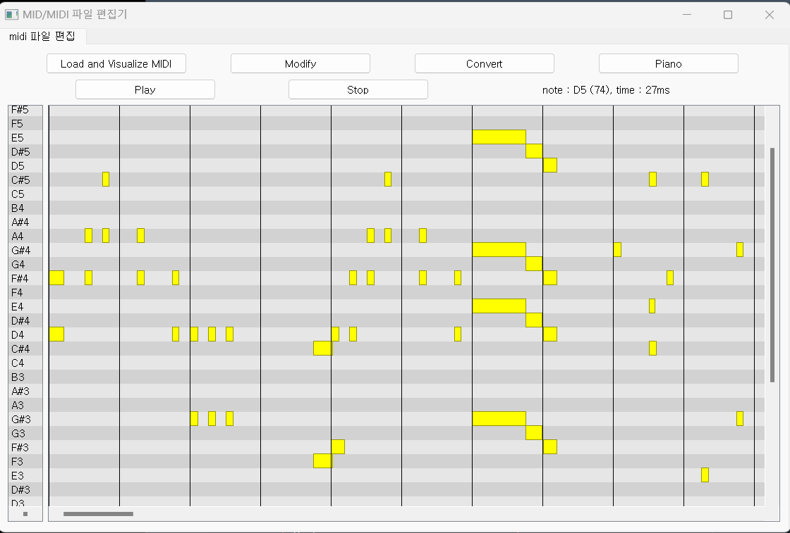
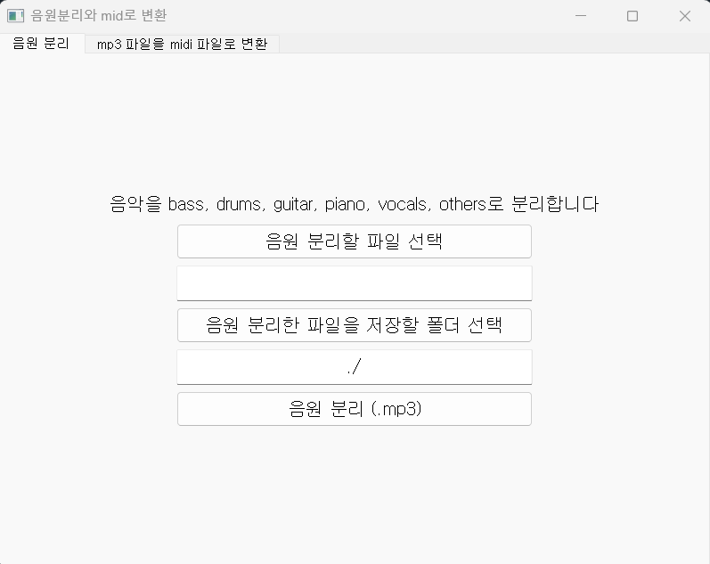
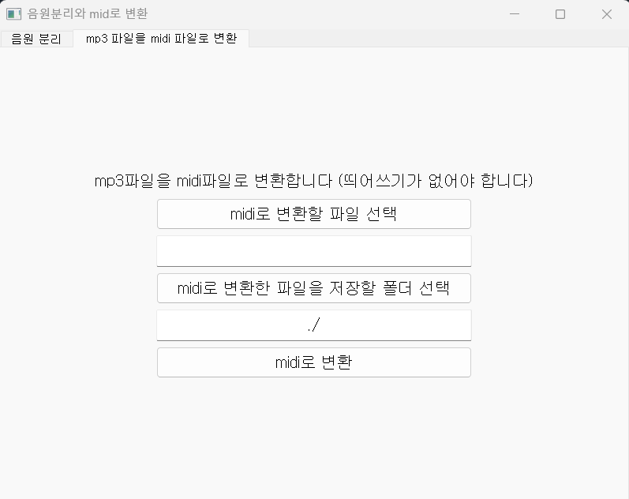
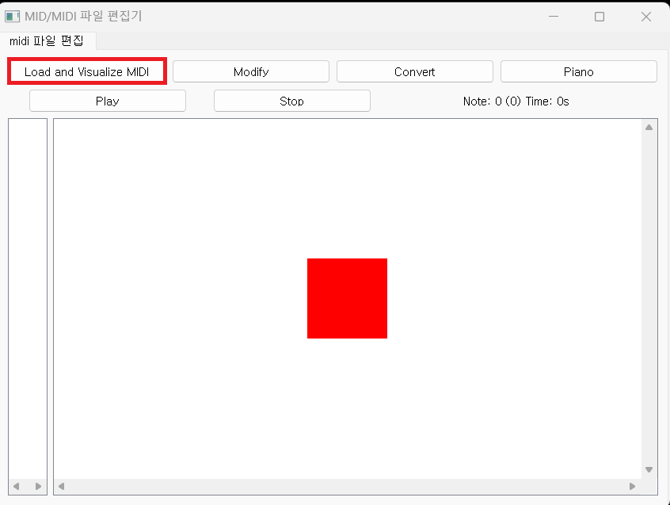
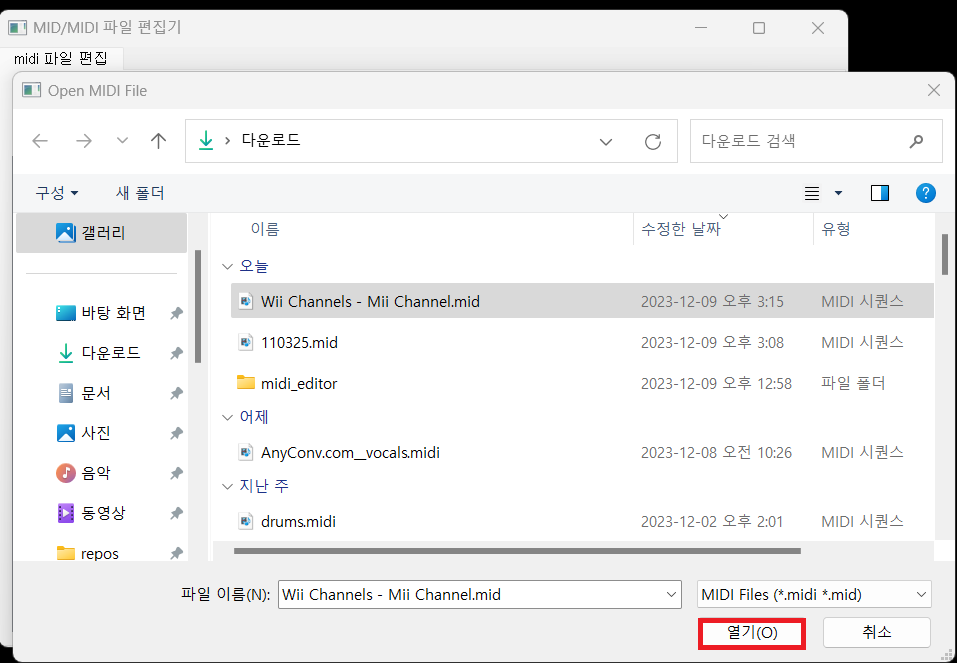
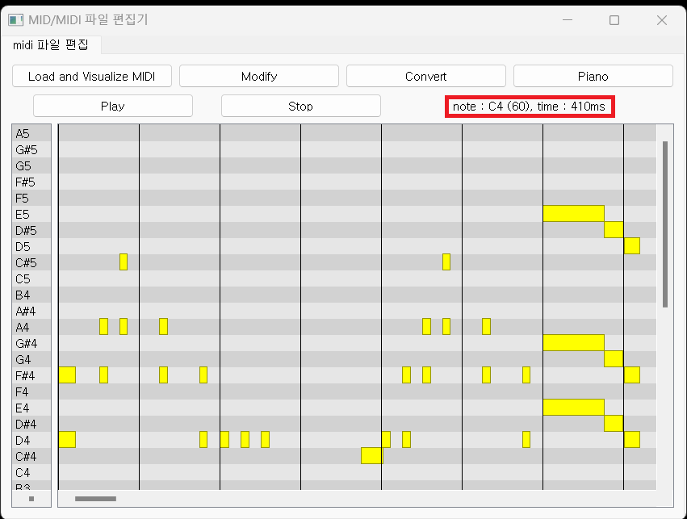
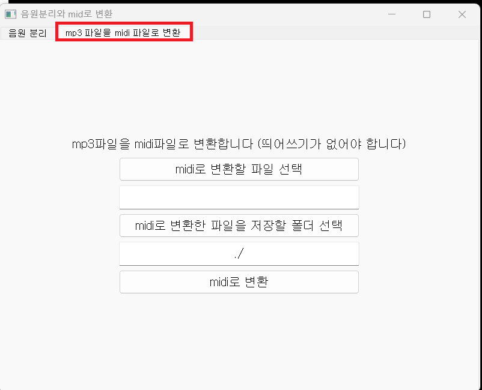
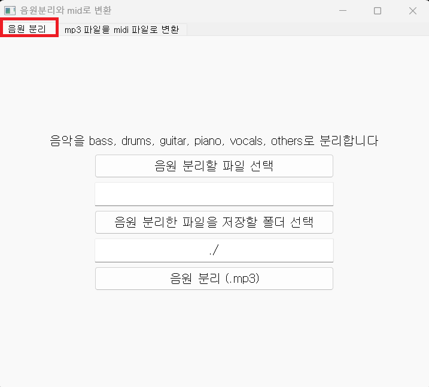

# Midi audiO file eDit Application

* MODA는 간단한 midi파일 파일 편집 기능을 제공합니다. 또한,

* facebookresearch의 demucs의 음원 분리를 소개하고 [demucs](https://github.com/facebookresearch/demucs) 

* spotify의 basic-pitch의 midi/mid 파일 변환을 소개합니다 [basic-pitch](https://github.com/spotify/basic-pitch) 

  

# 주요 기능

* midi파일을 편집합니다

<p align="center">

</p>

* demucs 라이브러리를 이용해 음원을 분리 합니다 [demucs](https://github.com/facebookresearch/demucs) github

  <p align="center">
  
  </p>

* basic-pitch 라이브러리를 이용해 음악파일을 midi 파일로 변환합니다 [basic-pitch](https://github.com/spotify/basic-pitch) github

  <p align="center">
  
  </p>


# 실행 방법

이 프로젝트는 demucs와 basic-pitch 라이브러리의 용량이 매우 커서 

모두 합치면 2~3 GB크기가 되기 때문에 두 부분으로 나눴습니다

(윈도우 11에서 만든 것이므로 다른 os나 다른 버전에는 실행되지 않을 수 있습니다)

* MID/MIDI 파일 편집기
* 음원분리와 mid로 변환


#### MID/MIDI 파일 편집기 설치

이 프로그램은 sys, PyQt5, numpy, threading, [pretty_midi](https://github.com/craffel/pretty-midi), [sounddevice](https://python-sounddevice.readthedocs.io/en/0.4.6/)라이브러리를 사용합니다

version : Python (3.11.2), PyQt5 (5.15.10), numpy (1.26.2), pretty-midi (0.2.10), sounddevice (0.4.6)()


##### 1 실행파일 다운로드 받기 : 오른쪽 Releases에서 다운로드 받을 수 있습니다

* Releases에서 midi_editor.zip 다운 받고 압축 풀기
  [release](https://github.com/momokaP/MODA/releases/tag/v0.0.1)

* 압축 푼 파일을 실행

  <p align="center">
  
  </p>

  <p align="center">
  
  </p>

  <p align="center">
  
  </p>
  
  

##### 2 실행파일의 바이러스를 의심해서 라이브러리 설치하고 midi_editor.py다운 받아서 실행하기

* midi_editor_v1.py 다운 받기 [release](https://github.com/momokaP/MODA/releases/tag/v0.0.1)


* 라이브러리들 설치하기 ( sys, threading은 표준 라이브러리, 만약 없다면 pip install 해서 설치하기)

  ```
  pip install PyQt5
  ```

  ```
  pip install pretty_midi
  ```

  ```
  pip install sounddevice
  ```

  ```
  pip install numpy
  ```

  

  예시) 

  필요한 라이브러리가 없는 환경에서 실행하면 이렇게 나온다 ( 가상환경으로 예시를 들어봤다 )

  <p align="center">
  
  </p>

  라이브러리 설치 후 실행한 결과

  <p align="center">
  
  </p>


#### 음원분리와 mid로 변환 설치

이 프로그램은 sys, PyQt5, demucs, basic_pitch 라이브러리를 사용합니다

version : Python (3.11.2), PyQt5 (5.15.10), demucs (4.0.1), basic_pitch (0.2.6)
 
이 프로그램은 실행 파일로 만들면 용량도 크고 ( 2.5GB 정도 ) 충돌도 많이 있기 때문에

 라이브러리를 설치하고 extract_convert.py을 다운 받아서 실행해주시기 바랍니다

 [release](https://github.com/momokaP/MODA/releases/tag/v0.0.1)


##### 1 라이브러리 설치하고 extract_convert.py다운 받아서 실행하기

* extract_convert.py 다운 받기

* 라이브러리들 설치하기 ( sys는 표준 라이브러리, 만약 없다면 pip install 해서 설치하기)

  ```
  pip install PyQt5
  ```

  ```
  pip install demucs
  ```

  ```
  pip install basic_pitch
  ```

  설치가 꽤 오래 걸릴 겁니다

  

  예시) 

  필요한 라이브러리가 없는 환경에서 실행하면 이렇게 나온다 ( 가상환경으로 예시를 들어봤다 )

  <p align="center">
  
  </p>

  라이브러리 설치 후 실행한 결과

  <p align="center">
  
  </p>


# 상세 기능

### MID/MIDI 파일 편집기로 MID파일 편집하기


먼저 [MIDI는 무엇인가?](https://ko.wikipedia.org/wiki/MIDI) 

간단히 말자하면 음악 및 음악 장치 간에 정보를 전송하기 위한 규약이며, MID/MIDI 파일은 실제 음악 소리 자체를 저장하는 것이 아니라, 음악을 생성하는 데 필요한 정보를 담고 있는 파일 형식입니다


MID/MIDI 파일 듣거나 다운받는 사이트  ->  [https://bitmidi.com/](https://bitmidi.com/)


MID/MIDI 파일 편집기로 위 사이트에서  다운로드 한

' Wii Channels - Mii Channel.mid ' 파일로 사용방법을 알려드리겠습니다

파일 링크 : [https://bitmidi.com/wii-channels-mii-channel-mid](https://bitmidi.com/wii-channels-mii-channel-mid)


* MID/MIDI파일 시각화

  1. Load and Visualize MIDI 버튼 누르기

     <p align="center">
     
     </p>

  2.  파일 선택 후 열기 버튼 누르기

     <p align="center">
     
     </p>

  3. MIDI 파일 표시       

     <p align="center">
     
     </p>

     이제 MID/MIDI 파일을 시각화한 결과를 볼 수 있습니다

     노란색으로 표시된 부분은 음(노트)이 위치한 곳이고 

     x축 방향으로는 시간길이, y축 방향으로는 음(노트)의 종류를 나타냅니다

     맨 왼쪽에는 음(노트)이 어떤 음(노트)인지 알려줍니다 

     1초 간격마다 검은색 세로선이 있습니다
     
     마우스를 움직이면 빨간색 네모로 표시한 곳 안에
     
     현재 마우스가 어느 시간에 있는지, 어느 음(노트)에 있는지 알려줍니다
     
     


* MID/MIDI 파일 재생하기
  
  https://github.com/momokaP/MODA/assets/144106144/3c36de8d-668e-4885-9964-39c504947a84
  
  음질이 좋진 않지만 
  
  Play버튼을 눌러서 MID/MIDI 파일 재생이 가능합니다. 멈추려면 Stop버튼을 누릅니다.
  
  Play버튼을 누르면 검은 수직선이 시간에 따라서 움직이고 가로 스크롤도 따라서 움직입니다
  
  가로 스크롤을 만졌다면 수직선에 따라서 움직이는 것을 멈춥니다
  
  ( 가로 창 크기조절을 하면 수직선이 느려집니다 )
  
  


* MID/MIDI 파일 편집, 저장

  

  1. 음(노트) 지우기

     Modify 버튼을 누르고 Start Time과 End Time, start Note와 end Note 입력한 뒤

     Volume을 0으로 하고 Modify! 버튼을 누르면 음(노트)가 삭제 됩니다

     표시된 음(노트)을 클릭하면 자동으로 Time, Note가 입력됩니다

     https://github.com/momokaP/MODA/assets/144106144/2965ceda-510e-4f66-aea7-79a72b9f50e9

     

  2. 음(노트) 수정하기

     Modify 버튼을 누르고 Start Time과 End Time, start Note와 end Note 입력한 뒤

     Volume을 0이 아닌 값으로 하고 Modify! 버튼을 누르면 음(노트)이 변경, 추가 됩니다

     https://github.com/momokaP/MODA/assets/144106144/c181db56-17e7-48ae-a49f-76492b934f33


  3. 결과 듣기

     https://github.com/momokaP/MODA/assets/144106144/ee182e3e-5a66-4a6f-9587-9108795e0570


  4. 저장하기

     Convert 버튼을 누르고 저장할 폴더와 저장할 파일명를 입력한뒤 저장 버튼을 누릅니다

     https://github.com/momokaP/MODA/assets/144106144/56d1af0b-11c6-4671-ba42-48a40adc9366

     
* 피아노

  Piano 버튼을 누르면 피아노 건반이 나옵니다

  각 음(노트)에 해당하는 버튼을 누르면 소리가 나오고 옥타브를 변환할 수 있습니다

  MID/MIDI파일을 수정 하면서 이게 어떤 음(노트)인지 듣고 싶을 때 쓰면 유용할겁니다

  https://github.com/momokaP/MODA/assets/144106144/36d5a443-a124-4550-aea9-35df734d56bc


### 음원분리와 mid로 변환으로 음악파일의 음원을 분리하고 mid 파일로 변환하기

  * mid/midi 파일로 변환하기

    

    mid/midi파일로 변환하는데 사용하는 라이브러리인 basic-pitch는 

    단일 악기나 목소리가 있는 음악 파일을 변환해야 결과가 잘 나옵니다

    여러 악기가 함께 연주하거나 여러 목소리가 있는 음악 파일을 변환하면 음이 여기저기에 있게 될 겁니다

    

    1. ' mp3 파일을 midi파일로 변환 ' 탭을 누릅니다

       <p align="center">
       
       </p>
       

    2. midi로 변환할 파일과 파일을 저장할 폴더를 선택 한뒤 midi로 변환 버튼을 누릅니다

       여기서 예제로 'SE_07_16_아코디언 시골길 밝은 효과음' 을 사용합니다

       SE_07_16_아코디언 시골길 밝은 효과음 / CC BY 라이선스  

       출처 : [https://gongu.copyright.or.kr/gongu/wrt/wrt/view.do?wrtSn=13355408&menuNo=200020](https://gongu.copyright.or.kr/gongu/wrt/wrt/view.do?wrtSn=13355408&menuNo=200020)

       <video  src="./video/변환.mp4"  controls> 대체텍스트 </video>

       

    3. basic-pitch로 음악파일을 mid/midi 파일로 변환하면 

       나름 음을 잘 나타내지만 완벽하게 mid/midi 파일로 변환하진 못합니다 

       위의 예시를 봐도 길게 연주되어야 하는 음이 여러번 나눠져서 연주됩니다

       따라서 MID/MIDI 파일 편집기로 자연스럽게 편집 하는 예시를 보여드리겠습니다

       https://github.com/momokaP/MODA/assets/144106144/94e1552d-4a6b-4e1c-8dde-05393cfc5ccc


       수정된 결과 들어보기 

       https://github.com/momokaP/MODA/assets/144106144/267bc73f-fdbe-4cad-8087-78edd62d578f


  * 음원분리하기

    1.  음원 분리 탭을 누릅니다

       <p align="center">
       
       </p>

    2.  음원 분리할 파일과 음원 분리할 파일을 저장할 폴더를 선택하고 음원분리 버튼을 누릅니다

       

        음원을 분리하면 htdemucs_6s라는 폴더가 생성되고 

        그 폴더 안에 음원 분리할 파일이름의 폴더가 생성되고

        그 폴더 안에 bass, drums, guitar, other, piano, vocals가 mp3형식으로 저장됩니다

       

        여기서 예제로 'YEAH', 'SE_01_03_신나는 펑키 아웃트로' 를 사용합니다

        YEAH / 기증저작물-자유이용 / 저작자명 : 김재영

        출처 : [https://gongu.copyright.or.kr/gongu/wrt/wrt/view.do?wrtSn=13073772&menuNo=200020](https://gongu.copyright.or.kr/gongu/wrt/wrt/view.do?wrtSn=13073772&menuNo=200020)

        SE_01_03_신나는 펑키 아웃트로 /  CC BY 라이선스

        출처 : [https://gongu.copyright.or.kr/gongu/wrt/wrt/view.do?wrtSn=13355275&menuNo=200020](https://gongu.copyright.or.kr/gongu/wrt/wrt/view.do?wrtSn=13355275&menuNo=200020)

        https://github.com/momokaP/MODA/assets/144106144/d855f4ee-316a-47eb-9a4b-f04e1e2a1d14

    3.  결과를 들어봅시다
        ##### SE_01_03_신나는 펑키 아웃트로

        bass
        
        https://github.com/momokaP/MODA/assets/144106144/25430136-f28d-49cd-8c31-c347ef15b2fd

        drums
   
        https://github.com/momokaP/MODA/assets/144106144/0ba48bfc-8741-4294-95c2-255f59660830
        
        guitar
   
        https://github.com/momokaP/MODA/assets/144106144/6bafe92e-ba58-48be-9c6f-a170475f2e12

        other
   
        https://github.com/momokaP/MODA/assets/144106144/ca3e8ff8-af45-42d8-9b97-004da9349cb7
   
        piano
   
        https://github.com/momokaP/MODA/assets/144106144/ab6a45bb-8458-49e1-aacd-809524d356d2

        vocals
   
        https://github.com/momokaP/MODA/assets/144106144/2d8f58e4-d885-4ee4-8754-52305d6fb5fa

        ##### YEAH

        bass
   
        https://github.com/momokaP/MODA/assets/144106144/1df4d65d-a558-4fb2-b199-2749e7655bfc
   
        drums
   
        https://github.com/momokaP/MODA/assets/144106144/627d0c52-d804-4d3e-9609-0db00e9bc3cd
        
        guitar
   
        https://github.com/momokaP/MODA/assets/144106144/4e199eb4-70b7-46f3-bade-b33e68a1d267
   
        other
   
        https://github.com/momokaP/MODA/assets/144106144/cd271093-71ae-4169-be54-273c625f2b4f

        piano
   
        https://github.com/momokaP/MODA/assets/144106144/79246e9a-da98-4918-b461-360ed03d9650

        vocals

        https://github.com/momokaP/MODA/assets/144106144/9f5df94c-3b9a-4b93-aa3d-2a546368e471
     

### 응용

이제 mid/midi파일을 편집할 수 있고, mid파일로 변환할 수 있고, 음원을 분리할 수 있습니다

그러면  'SE_01_03_신나는 펑키 아웃트로'의 음원을 분리해서 나온 

guitar의 음이 어떻게 이루어져 있는지 알아봅시다


1.  'SE_01_03_신나는 펑키 아웃트로' guitar를 mid/midi로 변환합니다

   https://github.com/momokaP/MODA/assets/144106144/261bd76a-7e41-4e3b-8be0-bab87164f3b0

2. 튀는 음들을 없애서 자연스럽게 수정합니다

   https://github.com/momokaP/MODA/assets/144106144/8d47ba9b-89cd-4186-ac77-16920707962a

3. 결과 듣기

   https://github.com/momokaP/MODA/assets/144106144/3a13e7d9-1084-4c88-8f47-5a43d5a1771a


# 라이센스

GPL-3.0 license

   

